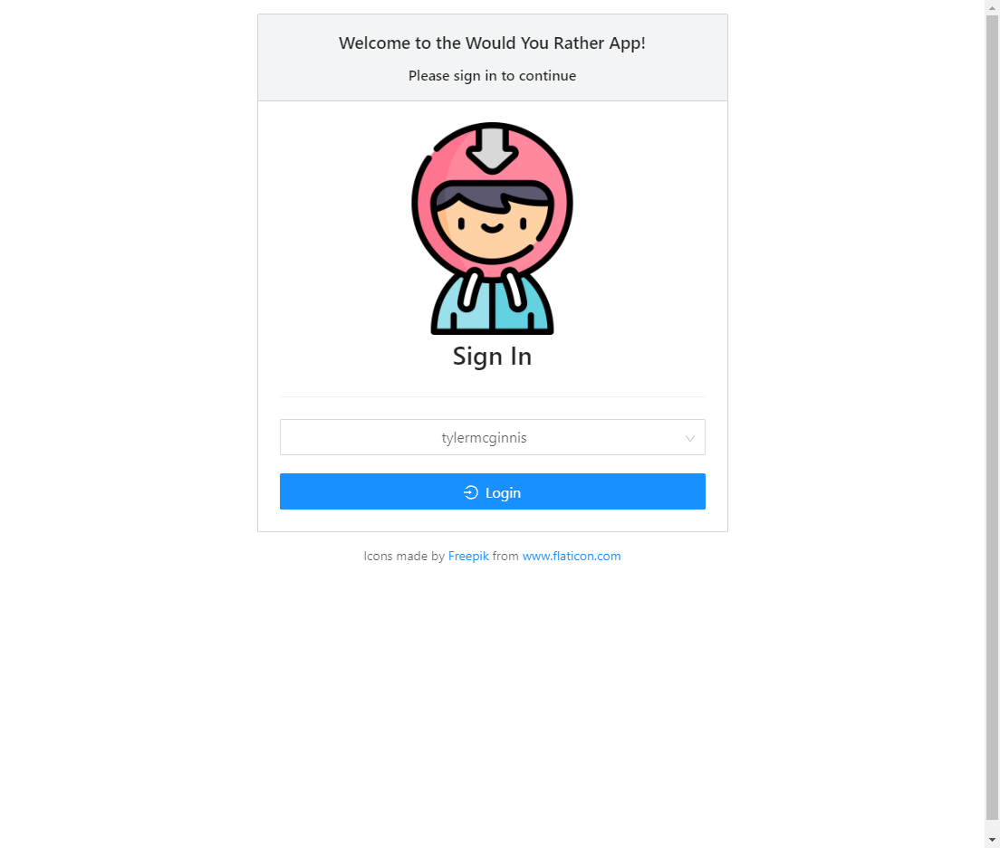
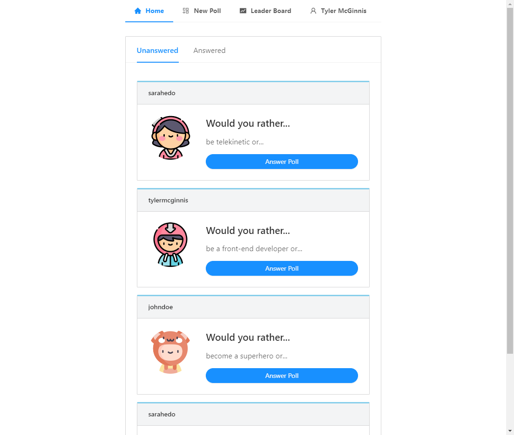
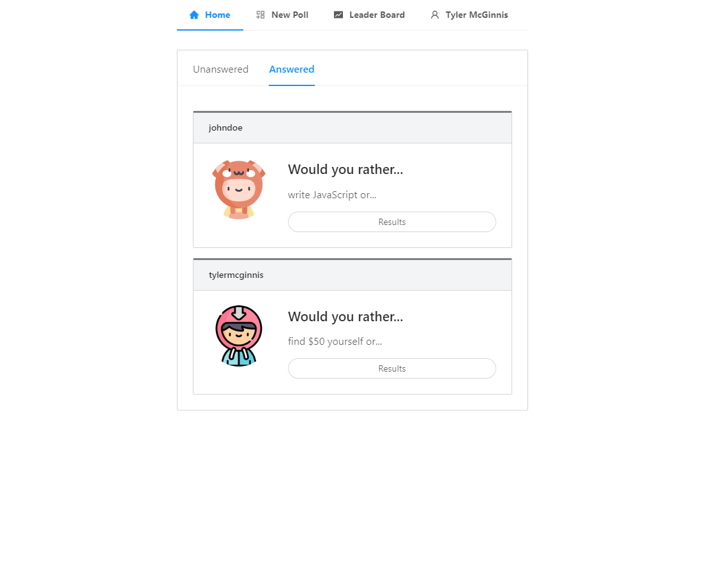
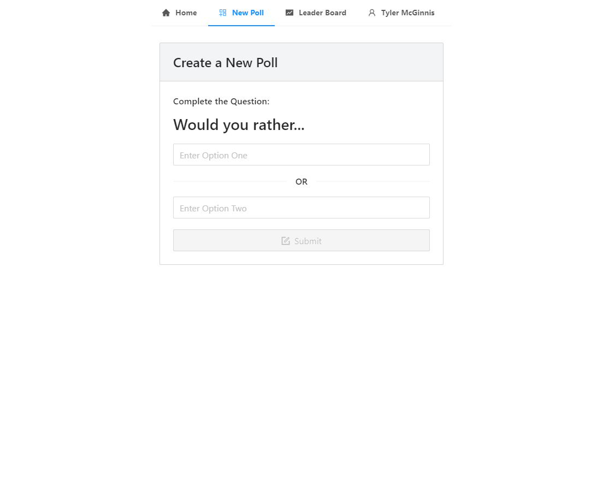
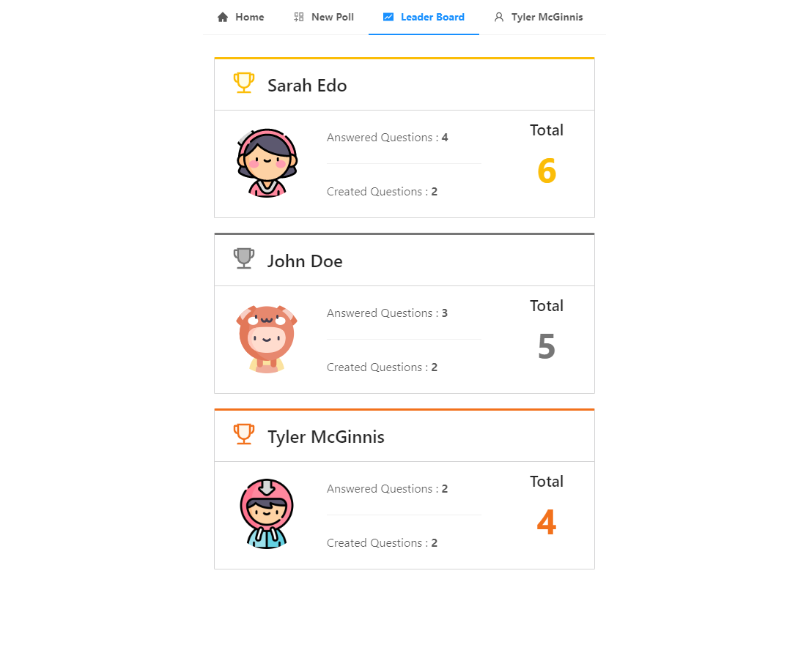
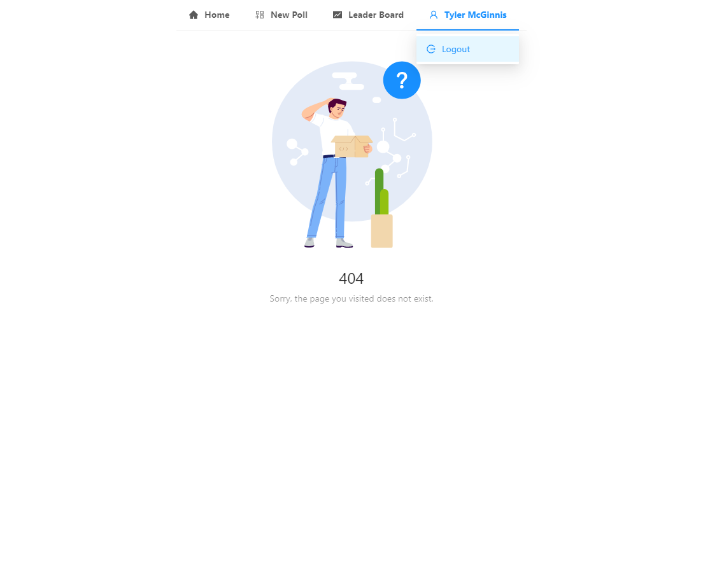

# ⚛Udacity React Nanodegree Project - Would You Rather❓

This repo is a code-along with the first project in the [React Nanodegree program](https://www.udacity.com/course/react-nanodegree--nd019).

## 📌Table of Contents

- [⚛Udacity React Nanodegree Project - Would You Rather❓](#udacity-react-nanodegree-project---would-you-rather)
  - [📌Table of Contents](#table-of-contents)
  - [💻Demo](#demo)
  - [🔰Project Setup](#project-setup)
  - [📷Screenshots](#screenshots)
  - [👨‍💻Features](#features)
  - [📜License](#license)
  - [😎Comment from Reviewer](#comment-from-reviewer)

## 💻Demo

Deployed to [Github Pages](https://caesiumy.github.io/reactnd-would-you-rather/#/)

## 🔰Project Setup

- clone the Project - `git clone https://github.com/CaesiumY/reactnd-would-you-rather.git`
- install the dependencies - `npm install`
- start a local server - `npm start`

## 📷Screenshots

    
Login

    

    
Home - Unanswered

    

    
Home - Answered

    

    
Add a New Poll

    

    
LeaderBoard

    

    
Error Page & Logout

    

## 👨‍💻Features

- Login
- Logout
- Get Unanswered & Answered Poll
- Create New Poll
- Get Leaderboard
- 404 Error Page
- Loading Bar

## 📜License

Icons made by [Freepik](https://www.flaticon.com/authors/freepik) from [flaticon](https://www.flaticon.com/)

## 😎Comment from Reviewer

